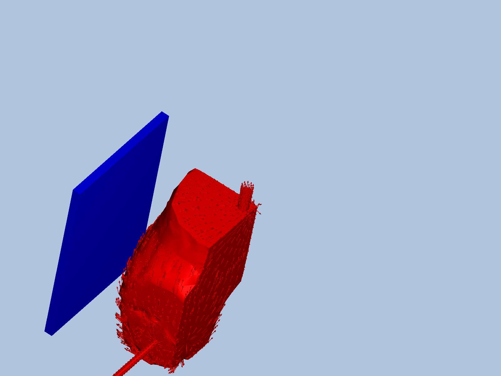
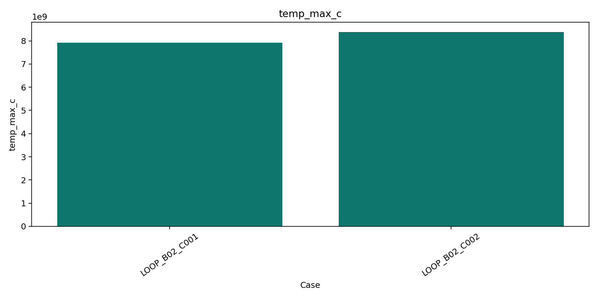
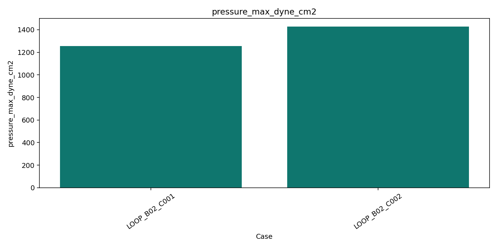

# CADEX (CFD Automated Design EXploration)

CADEX is a local automation layer for Autodesk CFD studies.

- It turns manual CFD sweeps into reproducible run pipelines.
- It has a local web console (`http://127.0.0.1:5055`) for config, cases, runs, logs, and outputs.
- It supports manual cases, LLM case generation, Bayesian design loops, and surrogate predict/validate mode.
- It is built for Windows + Autodesk CFD (not Linux/macOS).
- It has been run end-to-end on `Kani yawa.cfdst` (real run IDs and outputs below).

## Platform (Read First)

This project is currently **Windows-only** and requires **Autodesk CFD installed locally**.

- Tested environment: Windows + Autodesk CFD 2026 + Python 3.10+
- Not supported: Linux/macOS execution of CFD solve scripts

## Does It Work? (Real Kani Yawa Study)

Study used:

- `C:/Users/User/Downloads/Kani yawa/Kani yawa.cfdst`
- Design: `Design 1`
- Scenario: `Scenario 1`

Recorded on **March 5, 2026** from `runtime/design_loops/20260305_201335/loop_summary.json`:

- Objective: minimize `temp_max_c`
- Constraints: `pressure_max_dyne_cm2 <= 1500` and `velocity_mag_max_cm_s >= 300`
- Feasible-case temperature improved from `9,340,450,000` to `7,921,150,000` in 2 batches
- Improvement: **15.2%** while keeping pressure within threshold (`1255.03` at best feasible case)

Quick evidence:

| Run Artifact | Value |
|---|---|
| Loop ID | `20260305_201335` |
| Batch 1 best feasible | `LOOP_B01_C002` (`temp_max_c=9340450000`) |
| Batch 2 best feasible | `LOOP_B02_C001` (`temp_max_c=7921150000`) |
| Improvement | `15.2%` |

### Demo Outputs

CFD output screenshot (Kani Yawa):



Temperature chart from run outputs:



Pressure chart from run outputs:



## What You Can Do

- Run all / failed / changed cases from `config/cases.csv`
- Generate cases from natural language (Ollama or Groq)
- Run closed-loop Bayesian design optimization
- Train surrogate model from historical runs
- Predict thousands of combinations instantly, then validate top-N with real CFD
- Export ranked CSV, charts, screenshots, and report HTML/Markdown

## Quick Start (5 Minutes)

1. Install dependencies:

```powershell
pip install -r requirements.txt
```

2. (Optional) For local LLM features, install Ollama and pull a model:

```powershell
winget install Ollama.Ollama
ollama pull llama3.2:3b
```

3. Start server:

```powershell
python app.py
```

4. Open `http://127.0.0.1:5055`

5. In the web console:

- Click **Discover Studies** and select your `.cfdst`
- Click **Apply Path To Config** then **Save Config**
- Click **Introspect Study**
- Choose run mode and execute

## Run Modes

- `all`: run every case in `cases.csv`
- `failed`: rerun failed cases only
- `changed`: rerun cases whose fingerprint changed
- `predict`: surrogate-only prediction (no CFD solve)
- `validate`: surrogate picks candidates, then real CFD validates top-N

## API (Core)

- `POST /api/run` with `mode=all|failed|changed|predict|validate`
- `GET /api/status`
- `GET /api/latest-run`
- `POST /api/design-loop/start`
- `GET /api/design-loop/status`
- `POST /api/surrogate/train`
- `GET /api/surrogate/status`
- `POST /api/surrogate/predict`
- `GET /api/surrogate/coverage`

## Config Notes

- Main config: `config/study_config.yaml`
- Case matrix: `config/cases.csv`
- Generated outputs: `runtime/` (git-ignored)

If `solve.enabled: false`, runs are orchestration/dry style and may reuse existing results.

## Security Note (Local Tool)

By default, the local API has no auth. If needed, set:

```powershell
$env:CFD_AUTOMATION_API_KEY="your-secret"
```

Then use the same key in the web console top-right field.

## Development

- Tests: `pytest -q`
- CI runs dry-run-safe tests (no Autodesk CFD requirement on CI)
